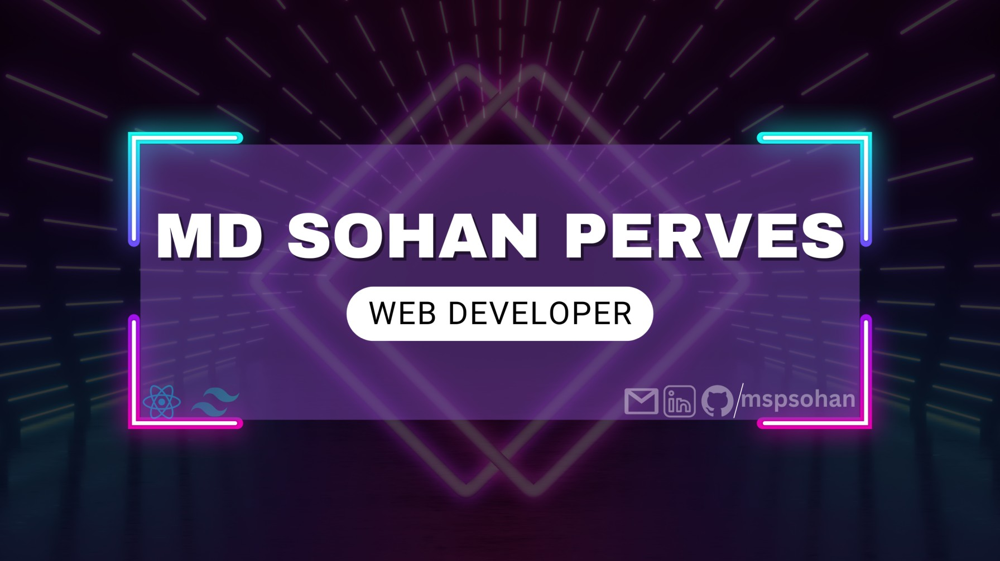

<!-- Profile View

  
 -->

<h1 align="center">Hi 👋, I'm Md. Sohan Perves</h1>
<h3 align="center">A passionate Web Developer from Bangladesh.</h3>

## 👩 About me:

As a <b>Web Developer</b>, I embody qualities of <b>self-motivation</b>, <b>detail-oriented</b>, and <b>results-driven</b> approaches. I excel in navigating ambiguity, embracing continuous learning, and fostering a lifelong learning attitude. Recognized for my strong work ethic, values, integrity, and trustworthiness.

## 🌐 Socials:

  

<h2>🥇 Main Skills:</h2>
💧 <b>FrontEnd</b>: HTML/HTML5, CSS/CSS3, JavaScript, React/Next.js, Tailwind CSS, Material UI.. 
🛠 <b>BackEnd</b>: Node.js, ExpressJS, Mongoose.. 
🛢 <b>Database</b>: MongoDB..  
🧰 <b>Tools</b>: Git, Github, Postman, Figma, Firebase, VS Code..

<!-- I am a frontend (MERN stack) developer, passionate about delivering exceptional user experiences and building robust applications. -->

<h2>⚡ Tech Stack:</h2>

<table align="center">
   <tr>
   <td align="center" width="90">
      
       Javascript
    </td>
    <td align="center" width="90">
    
       React
    </td>
    <td align="center" width="90">
    
       Redux
    </td>
    <td align="center" width="90">
      
       Next.js
    </td>
    <td align="center" width="90">
      
       Express
    </td>
    <td align="center" width="90">
      
       MongoDB
    </td>
    <td align="center" width="90">
         
       Firebase
      </td>
    </tr>
    <tr>
      <td align="center" width="90">
        
       Html
    </td>
      <td align="center" width="90">
         
       Css
      </td>
      <td align="center" width="90">
        
       Tailwind
      </td>
      <td align="center" width="90">
        
         MaterialUI
      </td>
      <td align="center" width="90">
         
       Figma
      </td>
      <td align="center" width="90">
         
       Git
      </td>
      <td align="center" width="90">
         
       Postman
      </td>
   </tr>
</table>

## 📊 GitHub Stats:

  

  
  

## 💫 Current overview:

🔭 I’m currently working on my Personal Projects, exploring new ideas, and refining my skills.  👯 I’m looking to collaborate on innovative web development projects that push boundaries.  🤝 I’m looking for help with staying updated on the latest industry trends and best practices in web development.  🌱 I’m currently learning more about advanced concepts in the MERN stack to enhance my expertise.  💬 Ask me about web development, and my journey into the tech world.    

<!-- ⚡ Fun fact: I'm passionate about exploring diverse cuisines and love experimenting with cooking in my free time.  -->

# Featured Projects

Welcome to the showcase of my featured projects! Each project represents my commitment to showcasing my skills. Explore the details below:

## 1. InventoHub - Inventory Management (MERN Stack)

### Project Overview:

-  Inventory management system using the MERN stack (MongoDB, Express, React, Node.js).
-  CRUD operations for product management and RESTful APIs for seamless communication.
-  Responsive design principles with Tailwind CSS and Material UI for an optimal user experience.

### Technology Stack:

-  **Front-end:** Html, Css, React.js, Tailwind CSS, Material UI
-  **Back-end:** Node.js, Express.js, Mongoose, MongoDB
-  **Others:** JWT, Firebase, Payment Gateway

<table>
  <tr>
    <td style="border: 1px solid white; padding: 5px 20px;">
      <a href="https://inventohub.netlify.app" style="font-size: 20px;">Live Website</a>
    </td>
    <td style="border: 1px solid white; padding: 5px 20px">
      <a href="https://github.com/mspsohan/inventohub-client" style="font-size: 20px;">Client Side Repository</a>
    </td>
    <td style="border: 1px solid white; padding: 5px 20px">
      <a href="https://github.com/mspsohan/inventohub-server" style="font-size: 20px; ">Server Side Repository</a>
    </td>
  </tr>
</table>

 

## 2. The Library - Library Management

### Project Overview:

-  Robust library management system with a strong focus on user experience.
-  Integrated search functionality using React and MongoDB for efficient data storage.
-  Implemented authentication and authorization features for access control.

### Technology Stack:

-  **Front-end:** Html, Css, React.js, Tailwind CSS
-  **Back-end:** Node.js, Express.js, MongoDB
-  **Others:** JWT, Firebase

<table>
  <tr>
    <td style="border: 1px solid white; padding: 5px 20px;">
      <a href="https://the-library-0.netlify.app" style="font-size: 20px; text-decoration: none;">Live Website</a>
    </td>
    <td style="border: 1px solid white; padding: 5px 20px">
      <a href="https://github.com/mspsohan/library-managements-client" style="font-size: 20px; text-decoration: none;">Client Side Repository</a>
    </td>
    <td style="border: 1px solid white; padding: 5px 20px">
      <a href="https://github.com/mspsohan/library-management-server" style="font-size: 20px; text-decoration: none;">Server Side Repository</a>
    </td>
  </tr>
</table>

 

## 3. Cosmico - Online Shop (MERN Stack)

### Project Overview:

-  Full-stack Online Shop developed using the MERN stack (MongoDB, Express, React, Node.js).
-  Responsive React front-end for an optimal user experience.
-  Integrated a secure shopping cart and collaborated on Stripe payment integration.
-  Back-end functionality for storing and managing data in MongoDB.

### Technology Stack:

-  **Front-end:** Html, Css, React.js, Tailwind CSS
-  **Back-end:** Node.js, Express.js, MongoDB
-  **Others:** Firebase, Payment Gateway

<table>
  <tr>
    <td style="border: 1px solid white; padding: 5px 20px;">
      <a href="https://cosmico-brand-shop.netlify.app" style="font-size: 20px;">Live Preview</a>
    </td>
    <td style="border: 1px solid white; padding: 5px 20px">
      <a href="https://github.com/mspsohan/cosmico-brand-shop-client" style="font-size: 20px;">Client Side Repository</a>
    </td>
    <td style="border: 1px solid white; padding: 5px 20px">
      <a href="https://github.com/mspsohan/cosmico-brand-shop-server" style="font-size: 20px; ">Server Side Repository</a>
    </td>
  </tr>
</table>

## ✍️ Random Dev Quote

  

