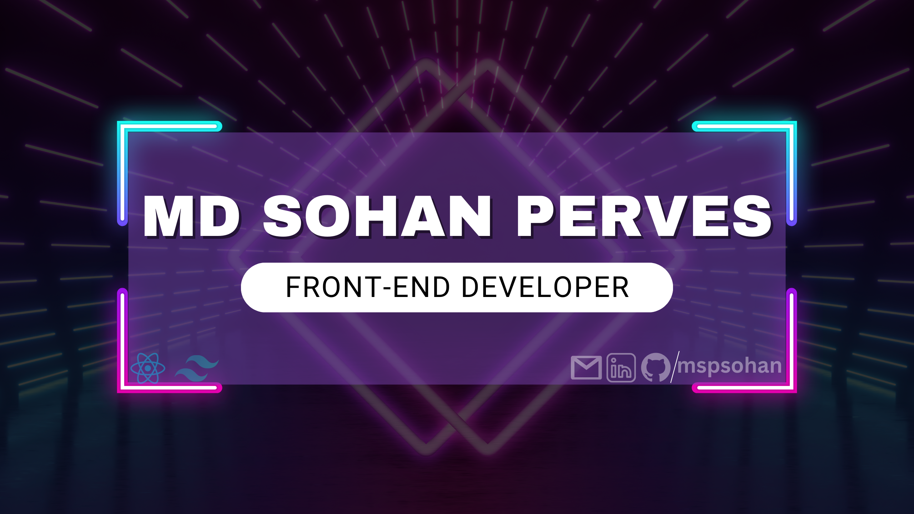

  

<!-- 
  
 -->

<h1 align="center">Hi 👋, I'm Md. Sohan Perves</h1>
<h3 align="center">A passionate frontend developer from BD.</h3>

## 👩 About me:

As a <b>Web Developer</b>, I embody qualities of <b>self-motivation</b>, <b>detail-oriented</b>, and <b>results-driven</b> approaches. I excel in navigating ambiguity, embracing continuous learning, and fostering a lifelong learning attitude. Recognized for my strong work ethic, values, integrity, and trustworthiness.

## 🌐 Socials:

  

<h2>🥇 Main Skills:</h2>
💧 <b>FrontEnd</b>: HTML/HTML5, CSS/CSS3, JavaScript, React/Next.js, Tailwind CSS, Material UI... 
🚀 <b>BackEnd</b>: Node.js, ExpressJS, Mongoose... 
💥 <b>Database</b>: MongoDB... 

I am a frontend (MERN stack) developer, passionate about delivering exceptional user experiences and building robust applications.

<h2>⚡ Languages and Tools:</h2>

<table align="center">
   <tr>
    <td align="center" width="90">
    
       React
    </td>
    <td align="center" width="90">
      
       Next.js
    </td>
    <td align="center" width="90">
      
       Javascript
    </td>
        <td align="center" width="90">
      
       Tailwind
    </td>
        <td align="center" width="90">
      
       MaterialUI
    </td>
    <td align="center" width="90">
      
       Express
    </td>
        <td align="center" width="90">
      
       MongoDB
    </td>
  </tr>
     <tr>
      <td align="center" width="90">
         
       Html
    </td>
      <td align="center" width="90">
         
       Css
      </td>
      <td align="center" width="90">
         
       Figma
      </td>
      <td align="center" width="90">
         
       Firebase
      </td>
      <td align="center" width="90">
         
       Git
      </td>
      <td align="center" width="90">
         
       Postman
      </td>
   </tr>
</table>

# 📊 GitHub Stats:

  

# 💫 Current overview:

🔭 I’m currently working on my Personal Projects, exploring new ideas, and refining my skills.  👯 I’m looking to collaborate on innovative web development projects that push boundaries.  🤝 I’m looking for help with staying updated on the latest industry trends and best practices in web development.  🌱 I’m currently learning more about advanced concepts in the MERN stack to enhance my expertise.  💬 Ask me about web development, and my journey into the tech world. 

<!-- ⚡ Fun fact: I'm passionate about exploring diverse cuisines and love experimenting with cooking in my free time.  -->

<!--

# 💻 Tech Stack:
                  -->

<!--
# 📊 GitHub Stats:
  -->
<!--   -->

---

